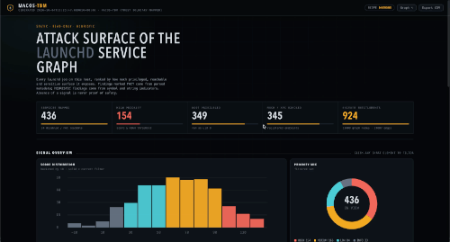
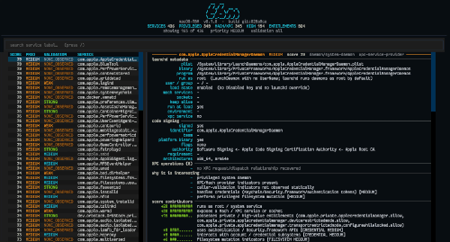

<div align="center">
<pre>
  __  __       
 / /_/ /  __ _ 
/ __/ _ \/  ' \
\__/_.__/_/_/_/
</pre>
</div>

<h1 align="center">macOS-TBM</h1>

<p align="center">
  <strong>macOS Trust Boundary Mapper</strong><br>
  Static launchd and Mach/XPC attack-surface mapping for manual security research.
</p>

<p align="center">
  <a href="#research-beta"></a>
  <a href="#quick-start"></a>
  <a href="#requirements"></a>
  <a href="#requirements"></a>
  <a href=".github/workflows/ci.yml"></a>
  <a href="LICENSE"></a>
</p>

<p align="center">
  <a href="https://x.com/rizasabuncu"></a>
  <a href="https://buymeacoffee.com/rizasabuncu"></a>
</p>

---

macOS-TBM correlates launchd plists, Mach-O structure, code signatures,
entitlements and Mach/XPC signals into a review queue, per-service dossiers
and a trust-boundary graph. It helps researchers choose what to investigate
and follow the evidence into a disassembler.

## Preview

| HTML report | Terminal dashboard |
|---|---|
|  |  |

## Research beta

This project is a **research beta**. Findings are research leads that need
manual verification. Coverage depends on the macOS build, binary architecture,
available metadata and the patterns the analyzers can recover.

> [!IMPORTANT]
> Research priority is not vulnerability severity. An imported API creates a
> candidate; it does not prove attacker control, authorization bypass or impact.
> `NONE_OBSERVED`, `NOT_OBSERVED` and `UNKNOWN_*` describe the analyzer's evidence,
> not the absence of a security check or the safety of a service.

The default pipeline is read-only and static. Radare2 enrichment is experimental
and opt-in. Runtime Mach/XPC checks are active and require separate explicit
flags; connection success does not prove that an operation is reachable or
permitted. Use the tool on systems you are authorized to analyze.

## Quick start

Requires macOS and Python 3.10+. The checkout runs with the Python standard
library; installation and UI packages are optional.

```bash
git clone https://github.com/riza/macOS-TBM.git
cd macOS-TBM

# Discover and statically analyze launchd daemons
python3 tbm.py scan --scope daemons

# Read the HTML report or terminal dashboard
open results/report.html
python3 tbm.py tui
```

A default scan writes these artifacts to `./results`:

| Artifact | Use |
|---|---|
| `report.json` | Structured findings, evidence and reproduction metadata |
| `report.html` | HTML dashboard with per-service dossiers |
| `scan.txt` | Detailed terminal report |
| `graph.json`, `graph.dot`, `graph.mmd` | Trust-boundary graph exports |

Use `-out DIR` to keep scans separate. `--json` without an output directory
streams JSON without writing report files. Reusing an output directory replaces
its report artifacts.

### Investigate one target

For example, select jobs whose service, Mach service or executable contains
`syspolicyd`; the available targets depend on the host:

```bash
python3 tbm.py scan syspolicyd -out ./results-syspolicyd
open results-syspolicyd/report.html
python3 tbm.py tui --report ./results-syspolicyd/report.json
```

From a default scan, review boundary relationships, passive NSXPC protocol
metadata and ranked research leads:

```bash
python3 tbm.py graph --boundaries
python3 tbm.py protocol /usr/libexec/syspolicyd
python3 tbm.py hunt --class lpe --top 20
```

`hunt` ranks leads using static evidence; its LPE/RCE/DOS/CRED dimensions are
research categories, not confirmed vulnerabilities. Use `--help` on each
subcommand for report selection, filters and export options.

### Optional installation and UI

Install the `tbm` command with an isolated package manager:

```bash
pipx install .
# Or include Rich/Textual presentation:
pipx install '.[ui]'
```

Without UI dependencies, the CLI retains a standard-library fallback.
The [getting-started guide](docs/getting-started.md) covers virtual environments
and the optional extras.

### Experimental Radare2 enrichment

Requires a separately installed radare2 executable and the Python `r2pipe`
binding. To install the binding and project in a virtual environment:

```bash
python3 -m venv .venv
source .venv/bin/activate
python3 -m pip install '.[deep]'

python3 tbm.py scan syspolicyd \
  --deep-analysis radare2 \
  --deep-min-score 0 \
  -out ./results-syspolicyd-r2
```

`--deep-min-score 0` includes low-priority candidate findings; normal deep scans
use a threshold and a finding cap. A target without eligible findings may have
nothing to enrich.

The backend adds executable `CALL` xrefs and bounded source-to-sink function
paths. It preserves exact sink addresses, unresolved wrapper/return-value
questions and finding-wide confidence. A structural path does not establish
argument flow, IPC request reachability, operation authorization or impact.
The r2 internal analysis timeout is not a hard deadline for every command.
See the [proof contract](docs/research-release.md) before interpreting promotions.

## What the reports contain

- **Service identity and surface:** plist origin, executable, derived run-as
  identity, configured/override enablement, Mach services and sockets. Enablement
  metadata is separate from observing a currently running service.
- **Binary and signing metadata:** architectures, libraries, imports, selected
  strings, Objective-C metadata, code-signing identity and entitlements.
- **Trust-boundary relationships:** service providers, declared lookups,
  client-held entitlements, statically observed checks and subsystem signals.
  Declared lookup relationships do not establish successful connections.
- **Operation evidence:** source/sink addresses, recovered paths, bounded
  argument flow, guard relationships, conflicts, missing evidence and next
  manual research questions. Binary-wide validation is separate from a guard
  for a particular operation; caller identity is separate from authorization.
- **Two scores:** research priority orders manual review; exploitability evidence
  summarizes the proof collected for an operation and is capped by maturity.
- **Reproduction metadata:** tool/code/rule hashes, OS build, architectures,
  analysis options, binary hash snapshots and analysis errors. These identify
  inputs and limits; they do not capture a complete reproducible system snapshot.

Operation maturity is explicit:

```text
SINK_CANDIDATE → REACHABLE_SINK → CONTROLLED_SINK → PRIMITIVE → IMPACT
```

Each step requires additional evidence. A finding can remain at any stage;
missing evidence never completes the chain automatically.

## Validation and known limits

The local beta validation passed **299 unit tests**, **13 authored r2 cases**,
**six compiled native Mach-O cases** and **71 selected evidence-contract tests**.
An isolated wheel installation passed CLI, packaged rule loading, JSON/HTML
assembly and report-schema checks. These are local results; the CI matrix is a
separate release gate.

| Evaluated area | Coverage and boundary |
|---|---|
| Native Mach-O fixtures | arm64 and x86_64, compiled at O0; never executed |
| Argument flow | Request-derived paths, constant paths and a wrapper-return case |
| x86_64 wrapper return | Remains unresolved in the compiled fixture |
| r2 interpretation | Authored responses test evidence promotion, not installed-r2 compatibility |
| Guards and dispatch | Portable contract tests for selected control-flow, authorization and dispatch cases |
| Real daemons | No published precision/recall benchmark or comprehensive manual ground truth yet |

Optimized binaries, arm64e dispatch, indirect calls, aliases and OS/toolchain
changes can exceed the recovered patterns. Fixture success is not a system-wide
accuracy claim. Inspect analysis errors, unknown reasons and missing evidence
before relying on a lead.

The [evaluation artifact](docs/research-evaluation.json),
[fixture sources](tests/fixtures/research/) and
[research beta guide](docs/research-release.md) describe what was measured,
three research examples and the release gates. To reproduce the checks:

```bash
python3 -m unittest discover -s tests -v
python3 tools/evaluate_research.py --output research-evaluation.json
```

Compiled fixture evaluation needs macOS and clang; unavailable environments
report that portion as not run. No fixture binary is executed and no runtime
service probe is part of these commands.

## Requirements and safety

- macOS for host discovery and Apple command-line tools (`codesign`, `nm`,
  `strings`, `plutil`, and `otool` for disassembly).
- Python 3.10+; UI packages and `r2pipe` are optional.
- clang for the compiled evaluation fixtures, not for a normal scan.

Default analysis does not change launchd configuration or inspected binaries.
Optional runtime checks are connect-only by default. Sending one empty XPC
message requires an additional flag and still does not test an operation's
arguments, authorization or post-condition. Runtime scope and limits are
explained in [Safety](docs/safety.md).

## Documentation

| Guide | What it covers |
|---|---|
| [Getting started](docs/getting-started.md) | Installation, requirements and first scan |
| [Usage](docs/usage.md) | Commands, filters, terminal review and dashboard |
| [Architecture](docs/architecture.md) | Collection, analysis and evidence models |
| [Trust model and scoring](docs/trust-model.md) | Graph relationships and score interpretation |
| [Evidence and limitations](docs/evidence.md) | Confidence, missing evidence and false-positive risks |
| [Research beta validation](docs/research-release.md) | Proof contract, examples, evaluation and release gates |
| [Querying and protocols](docs/querying.md) | Graph queries, NSXPC and entitlement checks |
| [Exporting](docs/exporting.md) | CSV and Markdown dossiers |
| [Extending rules](docs/extending.md) | Declarative signal and scoring rules |
| [Development](docs/development.md) | Tests, coverage and CI |

## Contributing

Evidence-backed false-positive and false-negative reports are especially useful.
Include the tool version, OS build, architecture, command and relevant finding,
plus the observation that contradicts it. Review reports for private paths,
third-party details and other sensitive data before sharing them.

- [Contribution guide](CONTRIBUTING.md)
- [Report a false positive](https://github.com/riza/macOS-TBM/issues/new?template=false_positive.md)
- [Report a bug](https://github.com/riza/macOS-TBM/issues/new?template=bug_report.md)
- [Security policy](SECURITY.md)
- [Release notes](CHANGELOG.md)

## Prior art and author

The project builds on the macOS research community's work on launchd, XPC,
entitlements and caller validation. Its contribution is to correlate evidence
and make manual review easier.

[MIT](LICENSE) © Rıza Sabuncu · [@rizasabuncu](https://x.com/rizasabuncu)

If macOS-TBM saves you research time, you can
[buy me a coffee](https://buymeacoffee.com/rizasabuncu).
